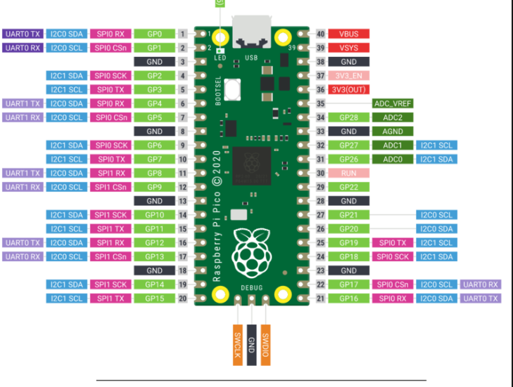

# Alice Keyboard WIP

### Pi Pico Pinout

### Alice Layout

### Alice Case

Used [@MajorKoos](https://github.com/MajorKoos) 3d Printed Alice Design - https://github.com/MajorKoos/KBDParts

### Firmware

Used [KMK](https://github.com/KMKfw/kmk_firmware) firmware to program the keyboard.

### Finished Keyboard Pictures

